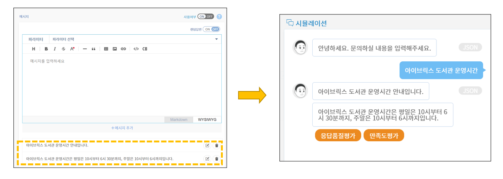
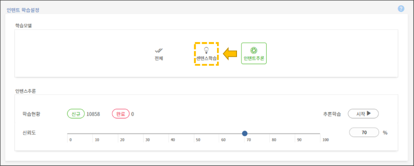
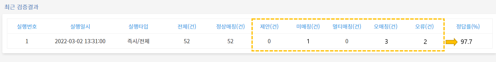

# 응답 메시지

### Q. 응답 메시지에 링크 주소/이미지/표 넣는 방법을 알려주세요.

응답 메시지 설정창에서 텍스트 도구 모음을 통해 세부사항들을 설정할 수 있습니다.&#x20;

.png>)

표시된 순서대로 표, 이미지, 하이퍼링크를 응답 메시지 안에 삽입할 수 있는 기능입니다. 이외에도 응답 메시지를 보다 효과적으로 전달하거나 메시지 안에 필요한 자료들을 삽입하려면 이 텍스트 도구 모음을 활용하시면 됩니다. &#x20;

### Q. 응답 메시지의 말풍선을 여러 개로 나누는 방법을 알려주세요. &#x20;

하나의 말풍선 안에 들어가는 텍스트가 너무 길면 가독성이 떨어질 수 있습니다. 이런 경우, 챗봇의 응답을 말풍선 여러 개로 나눠 출력하면 정보 전달력이 높아집니다. 아래와 같이 응답 메시지 설정 창에서 원하는 말풍선의 개수만큼 응답 메시지를 추가하면 됩니다.

### Q. 여러 개의 응답 메시지를 랜덤으로 출력하는 방법을 알려주세요.

여러 개의 응답 메시지를 구축하고, 사용자의 질의에 대한 답변은 랜덤으로 하나의 응답만 출력하게 할 수 있습니다. 응답 메시지 설정창에서 랜덤답변을 OFF에서 ON으로 변경하면 됩니다.          &#x20;

.png>)

### Q. 응답 메시지에서 연관된 다른 인텐트로 연결하는 방법을 알려주세요. &#x20;

시나리오의 흐름상 연관된 인텐트로 연결이 필요한 경우, 버튼으로 연결이 가능합니다.

➊ 우선, 기존 인텐트의 응답 메시지 설정창에서 버튼 템플릿을 만듭니다. label에는 "버튼명"을, value에는 "버튼값"을 기입하고, action은 "query"로 설정합니다.

➋ 설정한 value 값을 연결시킬 인텐트의 센텐스로 등록하고, 센텐스 학습 버튼을 클릭합니다.

아래와 같이, 기존 인텐트에서 버튼으로 다른 인텐트와의 연결이 가능합니다.

.png>)

### Q. 버튼명/버튼 URL을 바꾸는 방법 알려주세요.  &#x20;

응답 메시지 설정창의 템플릿 선택 화면에서 버튼 설정을 변경할 수 있습니다.&#x20;

버튼을 클릭 시에 URL로 이동할 수 있도록 설정하려면 위 그림과 같이 action 값이 "url"이어야합니다. label 입력창에서 해당 버튼의 버튼명을 변경할 수 있습니다. value 입력창에서는 연결시킬 URL의 주소를 입력합니다.  &#x20;

### Q. 챗봇의 인사말/실패 메시지를 수정하는 방법을 알려주세요.

챗봇의 기본 대화 설정에서 인사말 메시지와 실패 메시지를 수정할 수 있습니다. 해당 설정은 관리도구의 **\[설정 > 대화설정]** **메뉴**에서 변경할 수 있습니다.

* **인사말 메시지 설정**

인사말 메시지 설정 화면에서 위에 표시된 수정 버튼을 누르고 해당 인사말 메시지를 수정하고 적용할 수 있습니다. &#x20;

&#x20;      &#x20;

* **실패 메시지 설정**

실패 메시지 설정 화면에서 위에 표시된 수정 버튼을 누르고 해당 실패 메시지를 수정하고 적용할 수 있습니다.&#x20;

챗봇의 기본 대화 설정에 대한 자세한 안내는 아래의 "자세히 알아보기" 버튼을 눌러주시기 바랍니다.

****[**챗봇의 기본 대화 설정 자세히 알아보기 >**](../../undefined-2/undefined-1/undefined-3.md#2-2.) ****&#x20;

### Q. 챗봇이 응답하지 않아요.

챗봇이 정상적으로 응답하지 않는 현상으로는 다음과 같은 원인들이 있습니다.

* **태깅 누락의 경우**

센텐스 내 주요 명사의 엔티티 태깅이 누락된 경우, 챗봇의 응답이 정상적으로 작동되지 않을 수 있습니다. 태깅의 여부는 인텐트 관리 페이지의 센텐스 등록 화면에서 확인할 수 있습니다.&#x20;

엔티티 태깅 방법에 대한 자세한 안내는 아래의 "자세히 알아보기" 버튼을 눌러주시기 바랍니다.

****[**엔티티 태깅 자세히 알아보기 >**](../../undefined-2/undefined-1/undefined/undefined-1.md)****

* **챗플로우 누락의 경우**

인텐트 생성 시 챗플로우를 추가하지 않으면 챗봇 답변이 출력되지 않는 오류가 발생합니다. 챗플로우 생성의 여부는 인텐트 관리 페이지 하단의 챗플로우 화면에서 확인할 수 있습니다.  &#x20;

챗플로우 추가 방법에 대한 자세한 안내는 아래의 "자세히 알아보기" 버튼을 눌러주시기 바랍니다.

****[**챗플로우 추가 자세히 알아보기 >**](../../undefined-2/undefined-1/undefined/undefined-5.md#1-1.)****

* **센텐스 학습 버튼을 누르지 않을 경우**

센텐스 학습 버튼을 누르지 않을 경우, 챗봇이 센텐스에 대한 수정사항을 학습하지 못할 수 있습니다. 센텐스, 응답 메시지 추가 또는 변경사항이 있을 때는 반드시 관리도구 상단의 '**센텐스 학습**'  버튼을 클릭해주세요.

* **기계학습 설정에 따른 오류**

인텐트 학습 설정이 기계학습일 경우 오류가 발생할 수 있습니다. **\[설정 > 학습설정]** **메뉴**에서 인텐트 학습 설정이 "센텐스 학습"으로 설정되어 있는지 확인이 필요합니다. 기계 학습 기반인 인텐트 추론 모델로 설정이 되어 있다면 "센텐스 학습"으로 설정을 바꿔주세요.   ****                   &#x20;

&#x20;      &#x20;

* **센텐스 중복에 따른 오류**

동일한 센텐스가 다른 인텐트에도 등록된 경우, 인텐트끼리의 혼선으로 오류가 발생할 수 있습니다. 중복된 센텐스가 있는지 확인이 필요합니다. 일일이 인텐트 별로 확인하는 것보다 인텐트 엑셀을 일괄 내려받아서 해당 엑셀의 센텐스 시트 내에 중복값이 있는지 확인할 수 있습니다.                   &#x20;

* **라이센스 적용이 안된 경우**

NLU 결과를 봤을 때,  NF(명사추정범주) 혹은 NR(미등록어)이 뜨면, 라이센스 미적용으로 간주됩니다. 이 경우 아이브릭스 담당자에게 문의해주시기 바랍니다.

****

### Q. 챗봇이 계속 같은 말만 반복해요.

챗봇이 계속 같은 말만 반복하는 현상은 일시적인 오류일 수 있습니다. 재질의가 반복된다면 해당 시나리오에서 빠져나와 새로운 대화를 시도하는 방법이 있습니다.  **\[대화설정] > \[사용자] 메뉴**에서 설정된 대화중단 센텐스를 확인하고, 해당 센텐스를 질의하면 시나리오가 중단됩니다.&#x20;

.png>)

### Q. 응답률을 높이는 방법 알려주세요.

챗봇의 품질을 높이기 위해서는 챗봇이 질의에 대해 응답을 잘하는지 여부가 중요합니다. 응답률을 높이기 위한 방법은 다음과 같습니다.

* **오매칭 / 미매칭 발화 등록**

지식 검증을 실행한 후 검증 결과 화면에서는 챗봇의 유형별 매칭 오류 건수를 확인할 수 있습니다. 제안, 미매칭, 멀티매칭, 오매칭, 오류건들에 따라 챗봇의 정답률에 영향을 끼칩니다.   &#x20;

검증결과 상세 화면에서는 해당 오류 유형의 센텐스들을 확인할 수 있습니다. 센텐스들의 오류의 원인을 파악하고 해결한다면 챗봇의 응답률을 보다 높일 수 있습니다.                           &#x20;

* **응답률 통계에서 미응답 등록**

응답률 통계 페이지에서는 미응답 또는 제안 응답으로 출력한 사용자 발화에 대한 확인은 물론, 해당 문장을 학습문장(센텐스)으로 직접 등록할 수도 있습니다. 등록 시, 추후 동일한 사용자 발화가 유입되었을 때 정상적으로 응답하게 되므로 응답률 향상에 도움이 됩니다.

미응답 센텐스를 등록하는 방법에 대한 자세한 안내는 아래의 "자세히 알아보기" 버튼을 눌러주시기 바랍니다.

[**사용자 발화 등록 방법 자세히 알아보기 >**](../../undefined-3/undefined-2.md#undefined)****

### Q. 챗봇에서 안내되는 내용을 삭제(중단)하고 싶어요.

* **인텐트 및 챗플로우 삭제**

.png>)

.png>)

챗봇에서 안내되는 내용을 삭제하고 싶다면, 인텐트를 삭제하면 됩니다. 인텐트 목록 화면에서 해당 인텐트의 휴지통 아이콘을 클릭해서 삭제할 수 있습니다.

인텐트를 삭제하는 경우, 이미 생성된 챗플로우는 함께 삭제되지 않습니다. 따라서, 인텐트 삭제 후 챗플로우 메뉴로 이동하여 해당 인텐트와 연결된 챗플로우도 삭제해야 합니다.

* **챗플로우 사용 여부 및 사용 기간 설정**

.png>)

챗봇에서 안내를 한시적으로 중단하고 싶은 경우 또는 일정 기간에만 안내하고 싶은 경우에는 챗플로우 사용 여부와 사용 기간을 설정할 수 있습니다. 위 그림처럼 해당 인텐트의 챗플로우 관리 화면으로 들어가서 사용여부와 원하시는 사용 기간을 설정하시면 됩니다.
