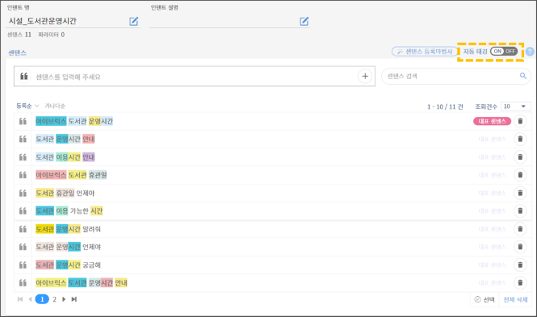

# 엑셀 일괄 업로드

### Q. 엑셀 일괄 업로드 시 업로드가 정상 작동하지 않아요.&#x20;

지식 일괄 업로드를 위한 엑셀 파일이 정상적으로 탑재되지 않는 경우, 아래의 엑셀 시트 작성 규칙을 잘 따랐는지 확인하시기 바랍니다.

* **양식 및 시트명 확인**

엑셀 일괄 업로드 시 엑셀 양식명과 시트명이 정해진 양식과 다를 경우에 오류가 발생할 수 있습니다. 각 엑셀 양식명과 시트명이 맞는지 확인이 필요합니다.&#x20;

****[**엑셀 업로드 양식 자세히 알아보기 >**](../../undefined-2/undefined-1/undefined-2.md#3-1.) ****&#x20;

* **유의어 사이에 쉼표 입력**

엔티티 일괄 업로드를 통한 다수의 유의어 등록 시, 각 유의어 사이에 '쉼표(,)'를 입력합니다. 이때 쉼표 뒤에 띄어쓰기를 입력하지 않아야 유의어가 정상적으로 등록됩니다. 유의어에 해당하는 엑셀 행에서 띄어쓰기가 입력된 부분이 없는지 확인해주시기 바랍니다.            &#x20;

* **특수문자 유무**

센텐스 끝에 .(마침표),(쉼표)?(물음표)!(느낌표) 특수기호가 있는 경우 또는 센텐스 중앙에 공백과 함께 해당 특수기호가 작성된 경우, 업로드 오류가 발생할 수 있습니다. 특수기호 작성에 오류가 없는지 확인해주시기 바랍니다.&#x20;

****

****

### **Q. 엑셀 일괄 업로드 했는데 자동 태깅이 되지 않아요.**

지식 일괄 업로드 시 엔티티 자동 태깅이 이루어지지 않는 경우, 아래의 원인들을 **** 확인해주시기 바랍니다.  &#x20;

* **태깅설정 여부**&#x20;

자동 태깅 설정을 누락한 경우는 두 경로에서 확인할 수 있습니다.         ****                &#x20;

지식 일괄 업로드 시 인텐트 엑셀의 '센텐스 시트'에서 자동 태깅을 설정할 수 있습니다. 해당 시트의 태깅설정 열이 모두 'Y'로 기입되어 있으면 해당 센텐스에 자동 태깅이 이루어집니다.

.png>)

지식 일괄 업로드 시트에서 문제가 발견되지 않았다면 관리도구 상에서 자동 태깅 설정을 확인해주세요. **\[지식관리 > 인텐트]** **메뉴**에서 해당 인텐트의 센텐스 등록 화면에서 자동태깅이 ON인지 확인해주세요. (아래 그림에 표시)    &#x20;

* **업로드 순서**&#x20;

엑셀 일괄 업로드 시, 엔티티 일괄 업로드를 먼저 진행한 이후에 인텐트 파일을 등록해야 센텐스에 자동 태깅이 이루어집니다.  전체 엔티티가 우선 등록되어 있어야 인텐트별 연결 엔티티를 파악하여 자동 태깅할 수 있기 때문입니다. 이 경우, 업로드 순서를 확인한 후 엔티티 엑셀과 인텐트 엑셀을 순서대로 재업로드를 해야 합니다. &#x20;

&#x20;

* **유의어 사이에 공백 여부**

엔트리의 유의어 간 쉼표 좌측/우측/좌우측에 공백이 있었을 수 있습니다. 관리도구 상 엔티티 관리 페이지에서는 공백 없이 등록된 것처럼 보이니, 엑셀 다운로드를 받아서 확인해야 합니다. 유의어 간 쉼표 주변의 공백을 제거한 후, 다시 유의어를 등록해주세요. 재등록해야 할 단어의 수가 많지 않다면 엔티티 관리 페이지에서 직접 입력해도 됩니다.&#x20;

### **Q. 수정된 엑셀을 업로드 했는데 응답이 중복으로 등록됩니다.**

기존에 지식이 탑재된 상태에서 센텐스 및 연결 엔티티, 응답 등을 수정한 엑셀 파일을 재업로드하게 되면, 아래와 같이 기존의 응답과 재업로드한 응답이 중복되어 등록됩니다.

.png>)

이런 경우에는 일일이 기존의 응답메시지를 삭제해야 하므로 주의가 필요합니다. 수정된 엑셀을 등록할 경우에는 이전 데이터를 삭제 한 이후에 재업로드해야 중복 데이터가 발생하지 않습니다.

### Q. 엑셀로 엔티티를 일괄 업로드 했는데 유의어가 공란으로 보여요.

엔티티 엑셀에서 유의어를 작성할 때 입력셀에 띄어쓰기(공백)을 입력했거나 맨 마지막에 입력한 문자가 쉼표일 경우, 유의어 부분이 공란으로 등록됩니다.                 &#x20;

업로드된 엑셀의 유의어 셀을 확인하고 오류 원인을 파악합니다. 띄어쓰기를 없애거나 입력하려는 유의어가 없다면 유의어 입력 셀을 null 상태(공백 없이 모두 삭제)로 변경하세요. 혹은 입력 셀 맨끝에 입력된 쉼표를 삭제해주세요.

