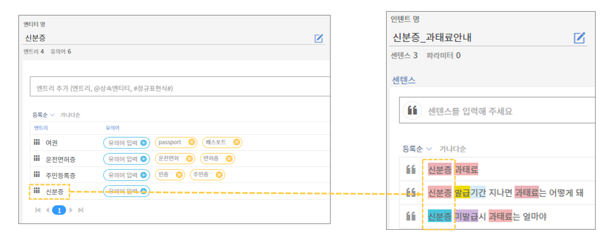

# 센텐스 구축 방법

### 센텐스 고정 법칙

센텐스 작성 전 센텐스 고정 법칙에 대해 먼저 알아봅니다.

* **등록 센텐스의 문법적 구성은 고정되어 있습니다.**
*   **사용자 질의가 등록 센텐스의 문법에서 벗어날 경우, 정확도가 하락합니다.**&#x20;

    (정확도 Score가 0.8 이상일 때 응답 정상 매칭)

.png>)

위의 예시는 "도서관 교육 신청"이라는 센텐스를 학습한 뒤, 1번과 2번 문장을 질의했을 때의 NLU 분석 결과 시뮬레이션 화면입니다.&#x20;

1번 질의인 "도서관 교육 신청은 어디서 해?"에는 응답이 정상 매칭되었지만, 2번 질의인 "도서관에서 진행하는 프로그램 들어보고 싶은데 신청은 어디서 해?”에는 응답이 매칭되지 않았습니다.

등록 센텐스와 사용자 질의가 문법적으로 완벽히 일치하거나, 어미 또는 술어구가 추가되는 경우에는 응답이 정상적으로 매칭될 수 있습니다. 그러나 등록 센텐스 사이에 동사 술어구를 질의하는 경우에는 학습된 문법적 구조가 파괴되어 응답이 미매칭됩니다. (단, 조사 및 어미는 센텐스 도중 질의하여도 영향이 없습니다.)

챗봇이 여러가지 형태의 질의를 이해할 수 있도록 다양한 문법 구조의 센텐스를 학습시켜주는 것이 중요합니다.

### 센텐스 작성 요령&#x20;

➊ **간단 명료하게 작성합니다.** &#x20;

* 챗봇을 검색의 도구로 사용하는 사용자들이 있으므로, 단어 위주의 간단 명료한 센텐스부터 생성합니다.&#x20;
* 긴 문장부터 학습시키는 경우 그보다 짧은 질의를 입력 받았을 때 응답이 매칭되지 않습니다.&#x20;
* 단어 키워드형 센텐스에서 문장형 센텐스 순으로 확장합니다.

.png>)

위의 예시처럼, 단독 명사 또는 명사끼리 결합된 형태의 단어형 센텐스에서 조사 및 동사, 어미를 섞어 술어구를 덧붙인 형태의 문장형 센텐스로 확장하면 보다 다양하고 효율적인 센텐스로 확장할 수 있습니다.

➋ **다양한 용언과 문장 구조를 활용합니다.**

* 명사는 엔티티로 확장할 수 있는 반면, 용언은 엔티티로 교체할 수 없기 때문에 용언을 다양하게 사용합니다.
* 센텐스를 구성하는 명사구가 갖춰진 후, 센텐스를 이루는 술어의 위치를 섞어 문장 구조를 다양화 합니다.

.png>)

위의 예시처럼, "알고 싶어"라는 용언을 "듣고 싶어", "보고 싶어", "받고 싶어" 등 비슷한 의미의 용언으로 변경해줌으로써 센텐스를 확장할 수 있습니다. 또한, 센텐스를 구성하는 구의 위치를 조정하면서 센텐스를 다양화 할 수 있습니다. "교육 신청 어디서 받아"라는 하나의 센텐스 안에서도 대명사 "어디"의 위치에 따라 지식의 구조를 확장시킬 수 있습니다.

아래 표는 센텐스의 구성 요소에 따라 응답 매핑에 영향을 주는 요소를 분류한 표입니다. 센텐스 구축 시에 참고하시길 바랍니다.   &#x20;

.png>)

****

➌ **센텐스 확장 시, 각 엔티티의 여러 엔트리 중 한 가지만 활용하여 구축합니다.**

* 여러 엔트리를 섞어서 사용하는 것과 같은 불필요한 데이터 낭비 및 같은 문법 룰의 재입력을 피하기 위해 엔티티에 소속된 엔트리 중 하나만 사용합니다.                    &#x20;

위 예시는 센텐스를 이루는 엔티티의 엔트리 중 한 가지위 내용은 ‘신분증’ 엔티티의 엔트리 중 ‘신분증’ 한 가지만을 활용하여 센텐스를 확장한 예시입니다. 센텐스 확장 시 하나의 엔티티에 소속된 다수의 엔트리를 섞어서 사용하면, 동일한 센텐스가 반복적으로 구축되거나, 작업 시 혼란이 발생할 수 있습니다.&#x20;

**센텐스 구축 예시 : \[관리자교육\_신청안내]**

아래는 \[관리자교육\_신청안내] 인텐트에 대한 센텐스 구축 예시입니다. 각 센텐스 확장의 좋은 예시와 나쁜 예시를 비교해보세요.          &#x20;

