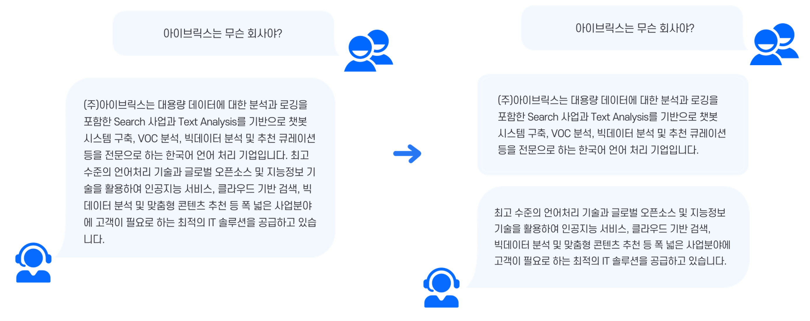

# 응답 메시지 작성 방법

➊ **페르소나 선정 및 반영 여부를 고려합니다.**

* **챗봇의 페르소나란?**

어떤 제품/서비스를 대표하는 가상의 인물 혹은 캐릭터의 프로필을 의미합니다. 이 페르소나에 의해 브랜드의 이미지, 서비스의 성격, 서비스와 사용자 간의 관계 등이 설정됩니다.

대부분의 챗봇 서비스는 서비스 고유의 페르소나(캐릭터 프로필) 및 페르소나의 이름을 가지고 있습니다. 챗봇의 페르소나에 의해 응답의 톤과 작성 기준이 결정되기 때문에, 응답 작성자가 누구든 일정한 응답 작성 스타일을 유지하게 됩니다.

.png>)

* **페르소나 예시**

아래의 예시처럼 같은 **** 센텐스라도 페르소나의 성격에 따른 응답메시지의 말투나 어조가 다르다는 것을 느낄 수 있습니다. ****&#x20;

➋ **응답의 가독성 및 전달력을 높이기 위해 응답 메시지의 형태와 전달 방식을 고려합니다.**

응답 메시지의 형태에 따라 가독성과 전달력이 달라질 수 있습니다. 텍스트 도구 모음이나 템플릿을 통해 폰트나 응답의 형태를 달리하여, 보다 정돈된 문장과 메시지로 핵심 정보를 전달하는 것이 중요합니다.

한번에 많은 정보를 전달할 때, 한 말풍선 안에 많은 텍스트가 들어가면 가독성이 떨어질 수 있습니다. 메시지의 내용이 길어질 경우, 개행을 하거나 말풍선을 나눔으로써 가독성을 높일 수 있습니다.

메시지의 전달력을 높이기 위해서는 글의 전체 내용을 일목요연하게 정리하여 핵심 정보를 전달하는 것이 중요합니다. 문단을 나눈 뒤 타이틀을 표기하거나, 관련 템플릿을 적용하는 등의 방법이 있습니다.

.png>)

또한 아래와 같이, 글머리에 기호(특수 문자) 또는 숫자를 사용하여 내용을 구조화하고, 간결한 문장으로 제공하면 가독성을 더욱 높일 수 있습니다. 다음과 같이 정리된 응답은 사용자가 핵심 정보를 한 눈에 파악하는데 큰 도움을 줍니다.

.png>)

➌ **챗봇 서비스의 목적과 용도를 이해해야 합니다.**&#x20;

응답 메시지는 챗봇의 주요 목적과 용도, 사용자 유형에 따라 작성 스타일이 달라집니다. 금융이나 법령 등을 안내하는 챗봇은 직관적이고 정확한 정보 전달에 중점을 두고 응답을 작성합니다. 패션 잡화 관련 쇼핑 챗봇은 트렌디하고 친절한 느낌을 강조한 응답을 제공합니다. 이처럼 응답 스타일은 챗봇의 활용 목적과 용도를 기반으로 결정됩니다.

* **민원 및 업무지원 챗봇**

민원 챗봇은 각 분야의 민원에 대한 문의를 대응하는 챗봇입니다. 업무지원 챗봇은 내부 업무 시스템과 연계하여 업무 효율을 향상하는데 도움을 주는 챗봇입니다. 이런 챗봇들의 특성상, 응답 메시지는 사용자들의 질의를 정확하게 파악하고 그에 맞는 정보를 이해하기 쉽게 전달하는 것이 중요합니다.

.gif>)

사용자 질의에 대해 정확한 정보 전달을 위해 그 의도를 파악하는 것이 우선입니다. 광범위한 사용자의 질의에 대해 세분화된 재질의와 연관 정보 연결 버튼을 통해 답변의 정확도를 높일 수 있습니다. &#x20;

챗봇의 어조는 각 분야의 민원에 대한 문의를 대응하는 챗봇의 특성에 따라 친절하고 예의 바른 말투를 사용합니다. 민원 챗봇의 경우, 상대방을 높이는 문장 종결형으로 대부분 ‘합니다’, ‘해요체’ 말투를 사용합니다. 정중하면서도 부드러운 민원 챗봇 이미지에 적합하기 때문입니다.

* **상품 소개 및 추천 챗봇**

상품 소개 및 추천 챗봇은 원하는 것을 말하면 제품을 나열하고 보여주면서 해당 상품을 소개하고 추천해줍니다. 이 챗봇의 경우, 구매율을 높이고 사용자에게 보다 친숙하게 다가가도록 응답 메시지를 만드는 것이 중요합니다. 회사 브랜드 이미지에 따라 상이할 수 있지만 추천 챗봇의 경우, 쇼핑을 도와준다는 컨셉으로 보다 친근하고 실제 사람과 대화하는 것 같은 캐주얼한 말투를 선호합니다.

상품 소개 및 추천 챗봇은 상담 효율 상승 뿐만 아니라 마케팅, 브랜딩 등의 연장선으로 활용할 수 있습니다. 예시처럼 브랜드 정체에 맞게 호칭과 말투를 선정하여 고객에게 보다 호감있는 브랜드 인상을 줄 수 있습니다.

* **교육용 챗봇**

교육용 챗봇은 학생들의 흥미 유발로 참여도를 높일 수 있으며, 학생의 학습 성과 및 만족도 등 피드백을 자동으로 교사에게 전송하면서 교사들의 관리 업무의 간소화 및 학습 성과의 분석을 제공합니다. 학습 과정에 있어서 즉각적인 피드백, 맞춤형 콘텐츠 제공 등 보다 효율적인 교육 효과를 주기 위한 응답들을 고려하는 것이 바람직합니다.&#x20;

교육용 챗봇은 학생들한테 선생님의 역할을 대신하여 학습의 동기와 정보를 전달하거나, 혹은 저연령층에게는 자연스럽게 학습의 재미를 불러일으키는 친구 같은 학습 도우미의 역할을 수행하는 경우들이 많습니다. 이처럼 챗봇의 목적과 사용자의 성격 및 연령층을 고려하여 호칭과 어조를 맞추는 것이 중요합니다. &#x20;

