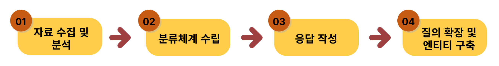

# 시나리오

## 1. 시나리오 정의

사람과 사람 간의 대화는 특정 현상 및 경험을 바탕으로 한 무수히 많은 발화와 응답들로 이루어져 있습니다. 대화 주제에 따른 발화 및 응답 세트를 시나리오라고 하며, 시나리오를 구성하는 각 요소들을 지식이라고 통칭합니다.&#x20;

경우에 따라 챗봇 내 모든 시나리오를 정리해 놓은 문서를 시나리오라고 부르기도 합니다. 해당 문서 내에는 질의 의도, 발화, 응답 내용(응답, 템플릿) 등이 작성되며, 지식 구축 명세서(설계서) 등으로 정의됩니다.

아래 예시는 도서관 운영시간을 주제로 구성한 시나리오입니다.

| 인텐트         | 대표 센텐스          | 응답 메시지                                                 |
| ----------- | --------------- | ------------------------------------------------------ |
| 시설\_도서관운영시간 | 도서관 운영시간 안내     | 아이브릭스 도서관 운영시간은 평일은 10시부터 6시 30분까지, 주말은 10시부터 6시까지입니다. |

&#x20;

## 2. 시나리오의 종류

시나리오는 일반적으로 비즈니스 시나리오와 일상대화 시나리오로 나뉩니다.

| 구분    | 설명                                                                                              |
| ----- | ----------------------------------------------------------------------------------------------- |
| 비즈니스  | <ul><li>챗봇으로 안내하고자 하는 핵심적인 주제와 관련</li><li>사실을 기반으로 서비스 해야 하는 업무용 시나리오           </li></ul>      |
| 일상대화  | <ul><li>비즈니스 시나리오 외 일상적인 대화 관련</li><li>자연스러운 대화 유도와 챗봇의 페르소나 형성에 도움을 주는 시나리오         </li></ul> |

## 3. 시나리오 설계 과정

챗봇 시나리오는 다음과 같은 과정을 통해 설계됩니다.

❶ 자료 수집 및 분석

시나리오 설계의 첫 단계로서, 챗봇 지식 선별을 위해 관련 홈페이지나 기초자료 등으로부터 자료를 수집하고, 분석을 진행합니다.

❷ 분류체계 수립

수집 및 분석된 자료를 바탕으로 사용자 질의나 응답과 같은 시나리오 구성 요소를 도출합니다. 해당 요소를 통해 질의 의도별로 지식 분류 체계를 수립합니다. (intent 정의)

❸ 응답 작성

각 질의 의도에 적합한 응답을 작성합니다. 응답 작성 시에는 챗봇의 페르소나는 물론 효과적인 정보 전달을 위한 응답 구성 방법을 고려해야 합니다.

❹ 질의 확장 및 엔티티 구축

챗봇의 지식 학습 및 사용자의 지식 접근성 향상을 위해 대화 의도별로 유사 질의를 확장합니다. 확장 시, 형태소 및 문장구조를 최대한 다양화하여 챗봇으로 유입될 가능성이 높은 실제 발화에 적절히 대응합니다. 또한 질의 내 주요 개체인 엔티티를 정의하고, 해당 엔티티의 동의어 및 유의어를 식별하여 챗봇 학습의 효율성과 질의의 확장성을 향상시킵니다.

