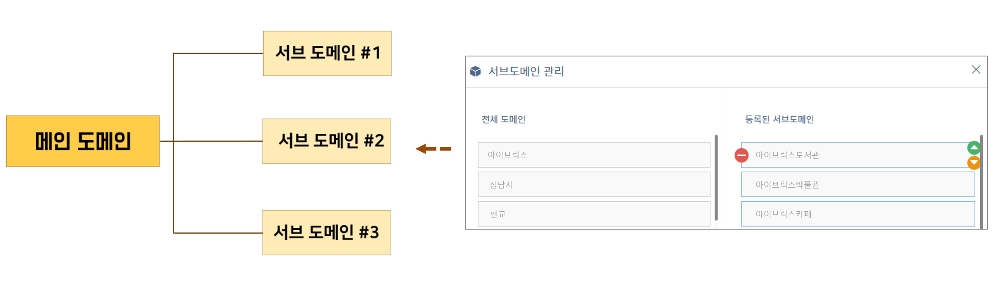

# 도메인

## 1. 도메인 정의 

도메인(Domain)은 관리도구 내 가장 큰 지식 단위입니다. 도메인을 등록해야 지식을 생성할 수 있으며, 도메인을 삭제하면 도메인에 종속된 지식도 모두 삭제됩니다.&#x20;

## 2. 도메인 구조

관리도구의 가장 큰 지식 단위인 도메인 안에는 다수의 인텐트들이 포함되어 있고 각각의 인텐트는 센텐스, 엔티티, 파라미터 등으로 구성되어 있습니다. (관리도구에서의 도메인 관리 방법은 **챗봇 만들기 >** [**도메인 만들기**](../undefined-2/undefined.md)에서 확인할 수 있습니다.)

도메인의 구조를 시각화하면 다음과 같습니다.

### 2-1. 서브 도메인 연결 구조

지식의 영역 또는 목적에 따른 도메인 분리 및 관리가 필요한 경우, 메인 도메인을 기준으로 서브 도메인을 구성할 수 있습니다. 사용자 질의 시 메인 도메인에서부터 서브 도메인의 등록 순서에 따라 가장 유사한 인텐트를 찾아 적절한 응답을 출력하게 됩니다.

서브 도메인의 연결 구조를 시각화하면 다음과 같습니다.

