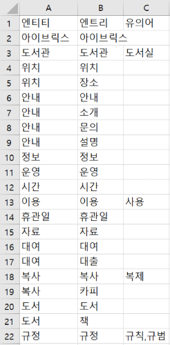
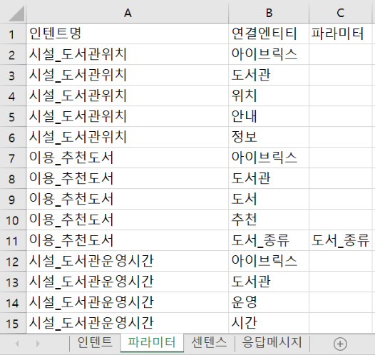
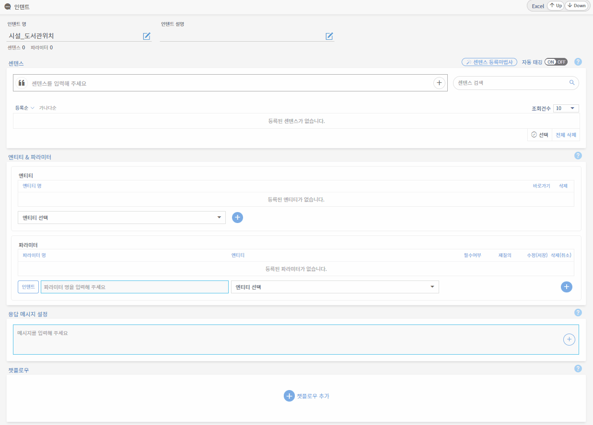
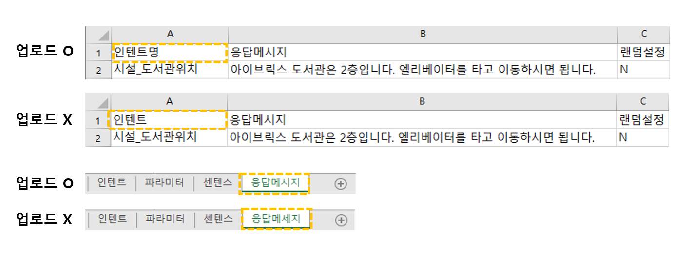

# 지식 일괄 업로드

## 1. 지식 일괄 업로드 개념

지식 일괄 업로드는 엔티티, 인텐트, 센텐스, 응답 메시지 등을 정해진 엑셀 템플릿에 작성한 뒤 관리도구에 한번에 업로드하는 기능입니다. 방대한 양의 지식을 신규 구축하거나, 지식 전반에 추가 사항 등이 발생했을 때 자주 사용됩니다. 관리도구에 같은 양의 지식을 일일이 직접 등록하는 것보다 더욱 효율적인 작업이 가능합니다.

엑셀 템플릿에 대한 세부 작성 규칙은 아래에서 확인해주시기 바랍니다.

## 2. 엔티티 일괄 업로드

엔티티 일괄 업로드는 엔티티, 엔트리, 유의어를 일괄 업로드하는 기능입니다. 엔티티 목록 화면의 오른쪽 상단에 있는 에서 Up 버튼을 클릭한 후 해당 엑셀을 업로드할 수 있습니다. 반드시 엔티티 템플릿을 먼저 업로드한 후에 센텐스 및 응답을 등록해야 엔티티 자동 태깅이 가능합니다. 아래는 엔티티 엑셀 템플릿 작성 규칙 안내입니다.&#x20;

* **엔티티** **:** 인텐트에서 활용되는 엔티티를 입력합니다.
* **엔트리 :** 엔티티에 속하는 엔트리를 입력합니다.
* **유의어** **:** 엔트리와 동일한 의미를 가진 유의어를 입력합니다.    &#x20;


**유의어 작성 및 등록 관련 주의사항**

엔티티 일괄 업로드를 통한 다수의 유의어 등록 시, 각 유의어 사이에 쉼표(,)를 입력합니다. 입력 시 쉼표 앞, 뒤에는 띄어쓰기를 하지 않도록 유의해주시기 바랍니다.

예시) 규칙, 규범 (X) / 규칙,규범 (O)               &#x20;


## 3. 인텐트 일괄 업로드

인텐트 일괄 업로드는 모든 인텐트, 파라미터, 센텐스, 응답메시지를 일괄 업로드하는 기능입니다. 인텐트 목록 화면의 오른쪽 상단에 있는  에서 Up 버튼을 클릭한 후 해당 엑셀을 업로드할 수 있습니다. 아래는 인텐트 엑셀 템플릿 작성 규칙 안내입니다. 인텐트 엑셀 템플릿은 인텐트, 파라미터, 센텐스, 응답 메시지 시트로 구성됩니다. 각 시트 내 입력이 필요한 열에 정확한 정보를 입력해야 업로드 시 오류가 발생하지 않습니다.&#x20;

### 3-1. 인텐트 시트

.png>)

* **인텐트** **:** 인텐트 이름을 입력합니다.
* **멀티설정 :** 멀티인텐트 사용 여부를 설정합니다. (Y - 사용 / N - 미사용)
* **디스플레이명** **:** [**멀티인텐트**](undefined-3.md#2-5.) 발생 시, 챗봇 응답 화면에 출력되는 인텐트 이름을 입력합니다.&#x20;
* **챗플로우 :** 입력된 이름으로 챗플로우가 자동 생성됩니다.

### 3-2. 파라미터 시트

* **인텐트명 :** 인텐트 이름을 입력합니다.
* **연결 엔티티 :** 해당 인텐트의 연결 엔티티를 입력합니다.
* **파라미터 :** 해당 인텐트의 파라미터를 입력합니다.

### 3-3. 센텐스 시트       &#x20;

.png>)

* **인텐트명 :** 인텐트 이름을 입력합니다.
* **센텐스 :** 해당 인텐트의 센텐스를 입력합니다.
* **태깅 설정** **:** 자동 태깅 여부를 설정합니다. (Y - 사용 / N - 미사용)&#x20;
* **대표 센텐스 :** 대표 센텐스 여부를 선택합니다. (Y - 사용 / N - 미사용)       &#x20;

### 3-4. 응답 메시지 시트

.png>)

* **인텐트명** : 인텐트 이름을 입력합니다.
* **응답메시지** : 해당 인텐트의 응답 메시지를 입력합니다.
* **랜덤설정** : 무작위 응답 출력 여부를 설정합니다. (Y - 사용 / N - 미사용)

## 4. 센텐스 일괄 업로드

센텐스 일괄 업로드는 특정 인텐트에 해당하는 센텐스와 엔티티, 응답 메시지를 일괄 업로드하는 기능입니다. 엑셀 템플릿은 인텐트 일괄 업로드 엑셀과 동일하지만 업로드하는 경로가 다릅니다. 인텐트 관리 화면 오른쪽 상단에 있는  에서 Up 버튼을 눌러서 업로드해야 센텐스가 일괄 업로드됩니다.

## 5. 엑셀 일괄 업로드 주의사항

엑셀 업로드 양식 및 시트명 변경 시 업로드가 불가하니 주의해야 합니다. 아래의 예시를 참고하여 업로드 양식을 확인한 후, 업로드 하시길 바랍니다. &#x20;

