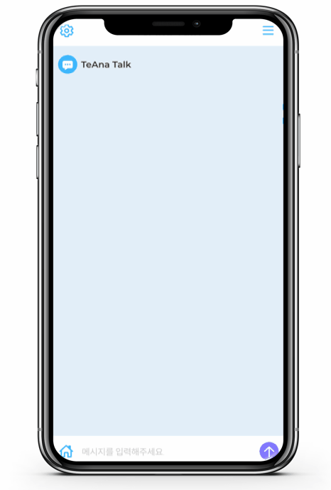
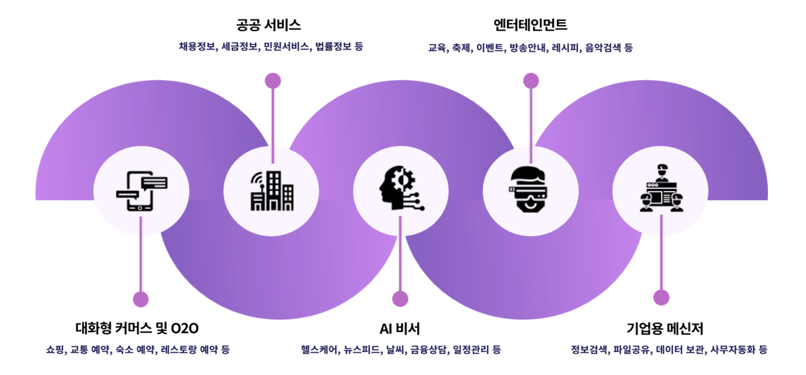
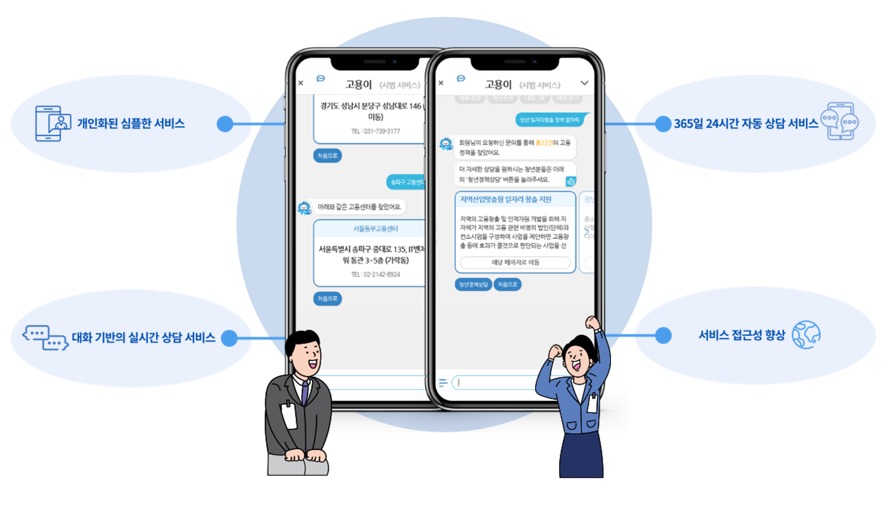
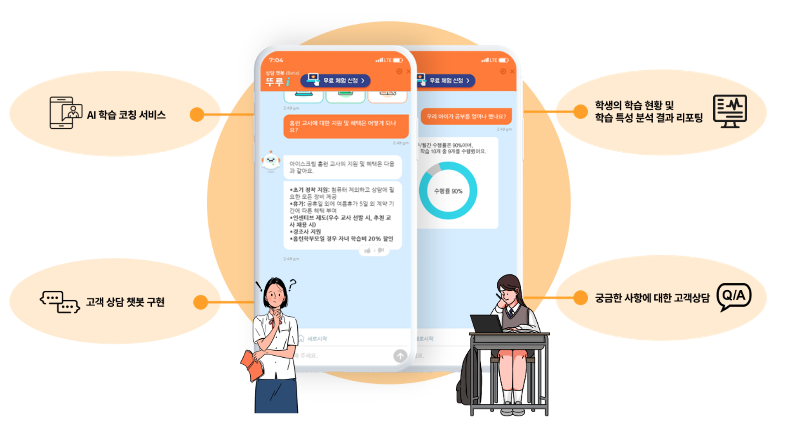
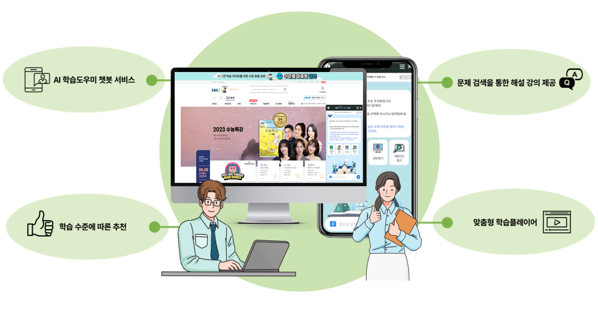

# 챗봇 안내

## 챗봇 개념

챗봇(Chatbot)은 채팅(Chatting) + 로봇(Robot)의 합성어로, 채팅창을 통해 음성이나 문자를 이용하여 대화하는 기능이 있는 컴퓨터 프로그램 또는 인공지능을 말합니다. 사용자 질의에 대한 정확한 의도를 파악하여 상황에 적합한 최적의 답변을 제시함으로써 사용자와의 커뮤니케이션을 실시간으로 지원합니다.             &#x20;

#### 챗봇의 효과                                                                           &#x20;

챗봇은 최근 고객의 참여 및 유지를 위한 가장 효과적인 방안으로, 여러 기업에서 중요한 커뮤니케이션 도구로 채택되어 사용되고 있습니다. 또한 기업과 고객 사이를 연결하는 소통 창구로써 기업의 브랜드 이미지 형성에도 큰 영향을 미치고 있습니다.&#x20;

챗봇은 실시간 상담을 통해 고객의 의견을 즉각적으로 반영할 수 있고, 다양한 업무를 자체적으로 처리하여 업무 효율성을 높여줍니다. 이에 따라 실무자는 보다 중요한 업무에 집중하여 업무 생산성을 향상시킬 수 있습니다. 또한 챗봇을 통해 다양한 업무들 간의 연계성을 높여, 각 업무 분야와의 시너지 효과를 극대화할 수 있습니다.

## 챗봇 활용 사례&#x20;

챗봇은 더욱 다양하고 폭넓은 분야에서 활용될 전망이며, 향후 기업 비즈니스에서 없어서는 안될 필수 시스템으로 자리 잡고 있습니다. &#x20;

아래는 아이브릭스에서 구축한 실제 챗봇의 사례들입니다.      &#x20;

#### 워크넷 일자리 자동 상담 챗봇 고용이

'고용이'는 언제 어디서나 다양한 채널로 워크넷 서비스를 제공받을 수 있는 자동 상담 챗봇 시스템입니다. 사용자의 발화 의도를 파악하여 맞춤 일자리 정보를 제공합니다.

* 개인화된 심플한 서비스 : 개인 맞춤형 일자리 및 인재 정보 제공으로 사용자 관점의 편의성을 증대합니다.
* 365일 24시간 자동 상담 서비스 : 365일 24시간 자동 상담 기능을 제공하여 상담 시간에 대한 국민들의 제약을 해소합니다.
* 대화 기반의 실시간 상담 서비스 : 워크넷 내부에 있는 고용 및 취업과 관련된 다양한 정보를 최신 ICT 기술을 활용하여 사용자 간 자동 질의 및 응답이 가능한 대화 기반 서비스로 제공합니다.
* 서비스 접근성 향상 : 워크넷 홈페이지와 워크넷 모바일 앱에서의 간단한 대화만으로 복잡한 검색 없이 정보에 쉽게 접근할 수 있습니다.

한국고용정보원은 ‘고용이’의 도입을 통해 워크넷 상담 센터 전체 문의의 80%에 달하는 단순 문의를 챗봇으로 처리하여 행정 업무의 효율성을 증대하였습니다. 더불어 구인/구직자의 사용 편의성을 함께 높이면서 채용에 특화된 선진적인 전자 정부 서비스를 실현하였습니다.

&#x20; &#x20;

#### 아이스크림 홈런 챗봇 뚜루i

아이스크림 홈런 챗봇인 '뚜루i'는 적응형 학습 분석(ALP)을 활용한 AI 학습 코칭 서비스를 통해 각 사용자(선생님, 학부모, 학생)에게 맞춤형 서비스를 제공하는 챗봇 시스템입니다.&#x20;

* AI 학습 코칭 서비스 : 고도화된 학습 분석을 활용해서 아이스크림 에듀만의 특화된 AI 학습 코칭 서비스를 제공합니다.
* 학생의 학습 현황 및 학습 특성 분석 결과 리포팅 : 일일/주간/월간 학습 현황, 학교 공부/특별 학습, 상세 분석/과목별/평가별 학습 수행 분석 등 데이터 분석을 통해 맞춤 리포팅 서비스를 제공합니다.
* 고객 상담 챗봇 구현 : 선생님, 학부모, 학생 각 사용자에 맞춰서 실시간으로 소통할 수 있는 인터페이스를 제공합니다.
* 궁금한 사항에 대한 고객 상담 : FAQ, 홈런 상품 관련 상담 등 민원 상담부터 신고 접수 처리까지 다양한 분야의 응대를 지원합니다.

아이스크림 홈런은 '뚜루i' 챗봇을 통해 AI 학습 맞춤 코칭 서비스와 사용자(선생님, 학부모, 학생)간 실시간소통 인터페이스를 제공하여, 에듀테크 시대의 경쟁력을 확보하고 새로운 교육 채널로의 확대를 선보였습니다.&#x20;

#### 지능형 문화 정보 큐레이팅 봇 큐아이

한국 문화 정보원의 '큐아이'는 AI 및 로보틱스 기술을 활용하여 관람객의 대화를 인지하고 다국어로 안내하는 전문 큐레이팅 봇 시스템입니다.

.png>)

* 로봇+챗봇이 융합된 서비스 : 국내 최초로 챗봇 기술을 로봇에 접목시킨 안내 및 도슨트 전용 큐레이팅 봇을 제작하였습니다.
* 자연스러운 안내 및 전문 큐레이팅 : NLU(자연어 이해) 기술을 통해 관람객과의 대화를 인지하여 자연스러운 전시 안내와 전문적인 큐레이팅 서비스를 제공합니다.
* 전시 공간 및 관람 공간에 적용 : 전국의 다양한 박물관, 미술관에서 선도적 문화 IT 서비스의 체험 기회를 제공하면서 새로운 방문 가치를 창출하였고 관람객의 문화 만족도를 높였습니다.
* 지속적인 고도화 사업으로 전국적인 서비스 확산 : 큐레이팅 서비스의 범위는 박물관을 넘어 도서관, 공항, 문화 시설에 이르기까지 전국적으로 널리 확장되고 있습니다. 큐레이팅 봇 '큐아이'는 공공 분야에서의 AI 및 로보틱스 기술이 잘 적용된 예시로 민간 분야 확대의 기반을 마련했습니다.

한국 문화 정보원은 지능형 문화 정보 큐레이팅 봇인 '큐아이'를 통해 박물관에서 제공하는 큐레이션 서비스 및 다국어 서비스를 보완하였습니다. 뿐만 아니라 우리나라 문화에 대한 관심 제고와 신기술 현장 체험의 기회도 마련하였습니다. 인공 지능 큐레이팅 봇 '큐아이’를 시작으로, AI 큐레이팅 서비스에 대한 문화 예술 분야의 관심과 만족도가 높아지면서 AI 기반 문화 데이터의 활용 가치가 향상되고 있습니다.

#### 연세 세브란스 챗봇 세라

연세 세브란스 병원의 챗봇 '세라'는 언택트 시대에 대응하는 고객의 소통 창구로, 안내, 예약, 원무, 검진 등 다양한 서비스를 24시간(주말, 야간) 제공하는 챗봇 시스템입니다.

.png>)

* 24시간 의료 상담 서비스 : 상담원과의 통화를 거쳐야만 가능했던 세브란스 병원의 업무(안내, 예약, 원무, 외래, 검진 등)를 채팅으로 쉽고 빠르게 진행할 수 있습니다. &#x20;
* 사용자 중심의 성장형 챗봇 : 사용자와 주고받는 데이터가 축적될수록 정교한 맞춤형 답변이 가능한 사용자 중심의 성장형 챗봇입니다.
* 다양한 편의 기능 제공 : 병원 서비스를 이용하는 주 사용층의 연령대를 고려하여, 글씨 크기 조정, 고빈도 문의 제공 등 다양한 편의 기능을 제공합니다.
* 자주 묻는 질문의 신속한 답변 : 채팅이 어려운 고객을 위해 문의사항과 관련된 부서로 '전화 바로 걸기' 서비스를 지원합니다.

연세 세브란스 병원은 챗봇 '세라'를 통해 병원을 찾는 고객에게 편의를 제공하고 예약 센터 직원의 업무 효율을 높였습니다. 코로나19로 인한 언택트 시대에 발맞춰, 의료 분야의 새로운 대안으로 챗봇 서비스가 떠오르면서 비대면 스마트 의료 문화의 큰 부분으로 성장하고 있습니다.&#x20;

#### EBS AI  학습 진단 시스템 및 챗봇 푸리봇  &#x20;

EBS의 AI 학습 진단 시스템과 푸리봇은 초중고 학급별 학습자의 수준을 실시간으로 진단하여, 맞춤형 학습 콘텐츠를 추천하고 제공하는 시스템입니다.&#x20;

* AI 학습 도우미 챗봇 서비스 : 인공 지능 시스템을 통해 개인 수준별 문제 풀이 및 해설 서비스를 구축하고, 학습자의 수준과 성향을 파악하여 맞춤형 학습을 제공합니다.&#x20;
* 학습 수준에 따른 추천 : 사용자의 학습 활동 및 학습 경험을 xAPI 기반으로 수집, 저장, 분석하여 개인 수준에 맞는 AI 기반 문제 추천 서비스를 제공하고, 강의 특성을 분석하여 과목별 강의 추천 서비스를 제공합니다.
* 문제 검색을 통한 해설 강의 제공 : 문제 코드, 교재명의 검색 뿐만 아니라 스마트폰으로 문항을 촬영하면 곧바로 해설 강의가 지원되는 챗봇형 문제 검색 및 풀이 서비스를 제공합니다.
* 맞춤형 학습 플레이어 : 강의 및 문항별 완강률과, 각 문항의 개인별 체감 난이도 및 예상 정답률을 알려줍니다.

최근 비대면 교육 환경의 중요성이 강조되어 많은 교육기관 및 대기업에서 EBS AI 학습 진단 시스템과 같은 학습 과정 추천 시스템을 활용하고 있으며, 기업과 사용자 모두 매우 높은 만족도를 보이고 있습니다.

#### 인천 서구청 민원 챗봇 서동이

인천 서구청의 민원 챗봇 '서동이'는 구민의 민원을 신속하게 해결하여 민원 만족도를 높이고, 행정 정보로의 접근을 용이하게 돕는 지능형 민원 상담 챗봇 시스템입니다.

.png>)

* 실시간 민원 응대 상담 서비스 : 단순 반복 민원을 24시간 상담할 수 있어 구민의 민원 편의가 향상되고, 실무 직원들의 단순 민원 처리 부담이 축소되었습니다.
* 사용자 중심의 정보 서비스 구현 : 직관적인 화면 구성으로 손쉬운 상담이 가능하며, 이용자 상황에 따라 답변을 세분화함으로써 이용자 개인에 따른 맞춤 안내로 고도화된 인공지능 상담을 구현했습니다.
* 감성 대화를 통한 친근감 형성 : 인천 서구의 대표 캐릭터인 서동이에게 감정을 부여하여 민원인의 감성에 공감하는 대화 방식을 구현하였고, 움직이는 배경 화면 및 이모티콘을 제공하여 사용자의 흥미를 유발하면서 지속적인 챗봇 사용을 유도합니다.
* 음성 상담 서비스 : 음성으로 질의했을 시 음성 및 텍스트로 답변하는 기능이 탑재되어 있어, 사람과 대화하듯 상담할 수 있습니다.

인천 서구청에서는 비대면 민원 창구 ‘서동이’를 통해 민원을 제기한 구민에게는 신속 정확한 응대를, 업무 담당자에게는 중요 현안에 집중할 수 있는 여건을 마련하며 언택트 시대의 챗봇 서비스 대중화에 기여하고 있습니다.

